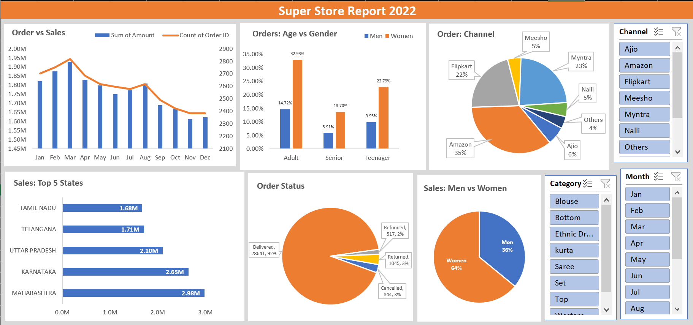

# 🛍️ Super Store Sales Dashboard

---

## 📌 Project Overview

The **Super Store Sales Dashboard** is an interactive Business Intelligence dashboard developed in **Microsoft Excel** to analyze sales performance, customer demographics, order status, sales channels, and regional performance.

The dashboard converts raw sales data into actionable insights using **Power Query, Power Pivot, Pivot Tables, Pivot Charts, and Interactive Slicers**.

---

# 🎯 Business Objective

The dashboard helps answer important business questions such as:

- Which months generated the highest sales?
- Which sales channels perform the best?
- Which states generate maximum revenue?
- What percentage of customers are men and women?
- Which age group contributes the most orders?
- How successful is order fulfillment?
- How can business performance be improved?

---

# 📷 Dashboard Preview

---

# 🛠 Tools Used

- Microsoft Excel
- Power Query
- Power Pivot
- Pivot Tables
- Pivot Charts
- Data Model
- Interactive Slicers
- Data Cleaning
- Data Visualization

---

# ⚙ Project Workflow

### 1️⃣ Data Collection

Imported raw Super Store sales data.

### 2️⃣ Data Cleaning

Removed duplicates, corrected data types, and handled missing values using Power Query.

### 3️⃣ Data Modeling

Created relationships between tables using Power Pivot Data Model.

### 4️⃣ Data Analysis

Built Pivot Tables to summarize business performance.

### 5️⃣ Dashboard Design

Created interactive Pivot Charts and connected slicers for dynamic filtering.

### 6️⃣ Business Insights

Generated insights for management and decision-making.

---

# 📊 Dashboard Features

✅ Monthly Sales vs Orders Analysis

✅ Age Group vs Gender Analysis

✅ Sales by Channel

✅ Top 5 States

✅ Order Status Distribution

✅ Men vs Women Sales

✅ Interactive Month Filter

✅ Product Category Filter

✅ Sales Channel Filter

---

# 📈 Key Business Insights

### 📅 Monthly Performance

- Sales peaked during March.
- Sales gradually declined towards the end of the year.

---

### 👩 Customer Demographics

- Women contribute approximately **64%** of total sales.
- Men contribute approximately **36%**.

---

### 👥 Age Group Analysis

- Adults represent the largest customer segment.
- Teenagers are the second-largest customer group.

---

### 🛒 Sales Channels

Top-performing sales platforms include:

- Amazon
- Myntra
- Flipkart

Amazon contributes the highest percentage of total sales.

---

### 📍 Top Performing States

- Maharashtra
- Karnataka
- Uttar Pradesh
- Telangana
- Tamil Nadu

These states generate the majority of revenue.

---

### 📦 Order Status

Most orders are successfully delivered with only a small percentage being cancelled, returned, or refunded.

---

# 💡 Business Recommendations

- Increase promotions during low-performing months.
- Focus marketing efforts on female customers.
- Continue strengthening Amazon as the primary sales channel.
- Expand inventory in top-performing states.
- Reduce cancellations through better logistics and inventory planning.

---

# 🚀 Skills Demonstrated

- Microsoft Excel
- Power Query
- Power Pivot
- Pivot Tables
- Pivot Charts
- Dashboard Development
- Data Cleaning
- Data Modeling
- Data Visualization
- Business Intelligence
- Sales Analytics

---

# 📌 Conclusion

This project demonstrates how Microsoft Excel can be used as a Business Intelligence tool to build an interactive dashboard for analyzing sales performance, customer behavior, and operational efficiency. It enables stakeholders to make informed decisions through dynamic visualizations and interactive filtering.

---

## 👨‍💻 Author

**Sunny Chawla**

Aspiring Data Analyst

📧 Connect with me on LinkedIn and GitHub.

⭐ If you like this project, consider giving it a Star!
